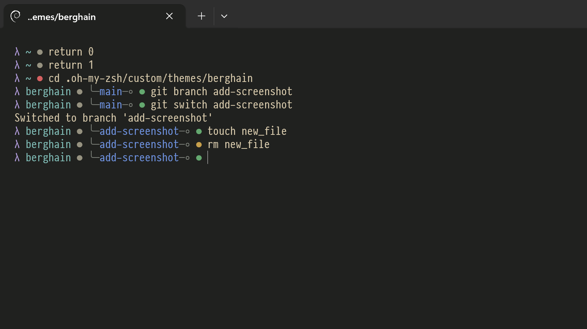

# berghain.zsh-theme

A stylish one-line theme for the discerning bouncer. Created for the Oh My Zsh framework.



## Install

```shell
curl "https://raw.githubusercontent.com/meshkinyar/berghain.zsh-theme/main/berghain.zsh-theme" > "$ZSH/themes/berghain.zsh-theme"
```
